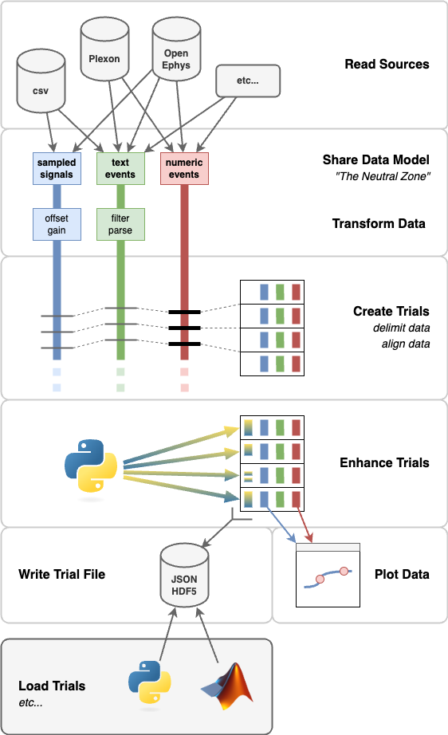

# Pyramid

Pyramid is tool for declarative neuro data synthesis and processing as trials.

The name "Pyramid" is a pun on "Python" and "FIRA", where FIRA is a set of long-standing Matlab analysis tools used by the [Gold Lab](https://github.com/TheGoldLab/Lab_Matlab_Utilities) at UPenn.  Pyramid is intended as a successor to FIRA.


# Overview

Here's an overview of the Pyramid flow:



## Read Sources

Pyramid can read data from various sources and synthesize these to suit a given experiment / paradigm.
As of writing (June 2024), Pyramid supports:

 - CSV files
 - Open Ephys Session data (on disk, binary or `.nwb`)
 - Open Ephys ZMQ connection (live, online)
 - Phy files
 - Plexon `.plx` files

Pyramid readers are extensible, so you can add your own to use locally and/or contribute them to the project.

The Readers are designed to view data in a sliding window over time, so as not to load entire data sets into memory.
This should allow Pyramid to work with live, online data as well as large data files.

## Share Data Model: *The Neutral Zone*

Readers feed data from raw sources in a shared data model called *"The Neutral Zone"*.
This is an intentionally simple data model.
The Neutral Zone supports buffers of:

 - Sampled Signals: 2D arrays where rows are samples at some nominal sample rate and columns are channels
 - Text Events: an array of timestamps and a corresponding array of strings
 - Numeric Events: 2D arrays where rows are events, the first column holds timestamps, and other columns hold event values

An experiment / paradigm can have more than one buffer of each type, distinguished by names.

## Transform Data

Pyramid can apply transformations to the data in each named buffer, to do things like:

 - apply an offset and/or gain
 - filter events
 - interpolate sparse events to make a regularly-sampled signal

Transformations operate on the Neutral Zone data model, so they don't have to know the details of any raw source format.

Pyramid transformers are extensible, so you can add your own to use locally and/or contribute them to the project.

## Create Trials: *delimit and align data*

Pyramid looks in a named buffer to find events that delimit trials in time.
As each new delimiting event arrives, Pyramid creates a new trial.

This is the main loop of Pyramid: transforming various buffers of signal and event data into one sequence of trials.

For each trial, Pyramid:

 - picks a start and end time based on delimiting events
 - queries each Neutral Zone buffer for data in the time half-open range `[start, end)`
 - populates the trial with a copies of the query results

After populating each trial, Pyramid allows buffers to discard data that came before.
This way, readers and buffers don't load entire data sets into memory at once.

Pyramid can also look for an event within each trial to use as the "zero" or "with respect to" time.
This allows each trial to have its own, local time origin.

Optionally, Pyramid can look for sync events that were observed by different readers, using independent clocks.
It can pair up sync events betwen readers and from these estimate per-reader clock offsets.
Pyramid can apply a per-reader clock offset correction once per trial.

## Enhance Trials

As each trial is created, Pyramid can apply per-trial "enhancers".
Enhancers are callbacks that process trial data and can make modifications or additions.

For example, Pyramid has enhancers that can:

 - apply smoothing in place to trial signals
 - parse trial saccades out of point of gaze signals
 - convert raw numeric codes into human-readable names and values
 - parse text into key-value pairs
 - apply a Python expression to trial signals, events, or other enhancements and save the result as a new enhnacement

Pyramid enhancers are extensible, so you can add your own to use locally and/or contribute them to the project.

## Plot Data

After each trial is created, populated, and enhanced, Pyramid can plot the results.
Plotters are callbacks that accept one new trial at a time and create or update a plot with a subset of trial data.

Pyramid has Plotters for:

 - plotting signals over time
 - showing raw numeric events over time
 - listing text events over time
 - plotting trial x-y data, like targets and saccades
 - plotting numeric events as spike rasters

Pyramid plotters are extensible, so you can add your own to use locally and/or contribute them to the project.

Plotting data may be helpful when following live data, when replaying data from disk, and when debugging other Pyramid components and custom code.

## Write Trial File

The main output of Pyramid is a "Trial File".
This persists the sequence of trials that Pyramid found for a given run / data set / experiment session.

Pyramid supports Trial Files as:

 - [JSON Lines](https://jsonlines.org/): text, human-readable, widely supported, not very space efficient
 - [HDF5](https://en.wikipedia.org/wiki/Hierarchical_Data_Format): binary, non-human-readable, fairly-widely-supported, allows data compression

When writing either format, Pyramid appends one trial at a time and leaves the file in a consistent state between trials.

Likewise, either format supports reading trials one at a time so downstream processing won't have to load the entire file into memory.

## Load Trials

The Pyramid process ends once it has consumed its data sources and written a Trial File.
From there -- hopefully -- the Trial File will be a convenient format to support downstream analysis.

Pyramid has utilities to help downstream loading of the Trial File in either Python or Matlab.

Python users can import Pyramid's own [trial_file](./src/pyramid/trials/trial_file.py) module and use the `TrialFile` Python class to iterate over trials.

Matlab users can add the [matlab/](./matlab/) subfolder of this repo to the Matlab path and use the `TrialFile` Matlab class to iterate over trials.


# Documentation

Here are some docs with details about how to use Pyramid and examples you can run.

For installation instructions, see [Installation](#installation) below.

## Declarative Confituration with YAML

All of the steps descried above can be confgiured and customized declaratively, via a YAML file.
The Pyramid YAML file for your experiment / paradigm is what drive's Pyramid's behavior.
It captures the outline and the details of what you want Pyramid to do.

For a detailed, informal schema of Pyramid YAML files -- expected syntax, what's supported, links to code, etc. -- please see the [yaml-schema.md](./docs/reference/yaml-schema.md) here in this repo.

## Tutorial and examples

The [docs/](./docs/) folder of this repo contains several working examples that you can use to try workign with Pyramid.
You might start with these two:

 - [core-demo](./docs/core-demo/) is a minimal example that parses a few csvs into trials.
 - [psychopy-demo](./docs/psychopy-demo/) is a more realistic demo that you can use to analyze a simple PsychoPy task.

# Installation

Pyramid should be straightforward to install using Coda and pip.

## Conda

Pyramid's Python dependencies are captured in the [environment.yml](./environment.yml) in this repo.
You can use this `pyramid` environment directly, or set up your own environment that satisfies the same dependencies.

If you don't have conda yet, you can use these instructions to [install miniconda](https://docs.conda.io/projects/conda/en/latest/user-guide/install/index.html).

With that you can obtain this repo and set up the `pyramid` environment:

```
git clone https://github.com/benjamin-heasly/pyramid.git
cd pyramid
conda env create -f environment.yml
```

If you've already done that in the past but you want to make sure you're up to date, you can update your local environment:

```
cd pyramid
git pull
conda env update -f environment.yml --prune
```

## pip

Now you can install Pyramid from this repo into the `pyramid` environment on your machine.

```
conda activate pyramid
pip install .
pyramid --help
```

If you've already done that in the past but you want to make sure you're up to date, you can reinstall pyramid.

```
git pull
pip install .
pyramid --help
```

## dev tools

During development I'm also using [hatch](https://github.com/pypa/hatch) and [pytest](https://docs.pytest.org/en/7.1.x/getting-started.html) to manage Pyramid as a Python project.  Most users won't need to use these.

I'm manually installing these into the `pyramid` environment on my machine.

```
conda activate pyramid
pipx install hatch
pip install pytest pytest-cov
```

I'm running the Pyramid unit and integration tests like this:

```
hatch run test:cov
```

Hatch is smart enough to install pytest automatically in the tests environment it creates.
The reason I also install pytest manually is so that my IDE recognizes pytest for syntax highlighting, etc.
