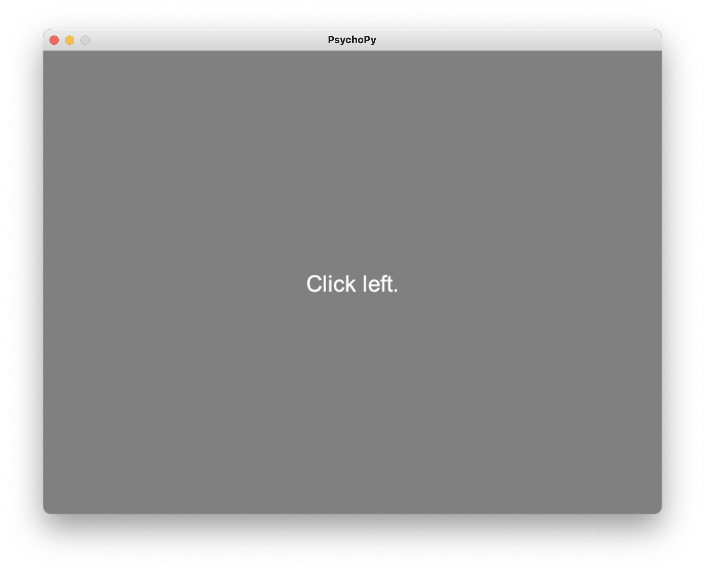
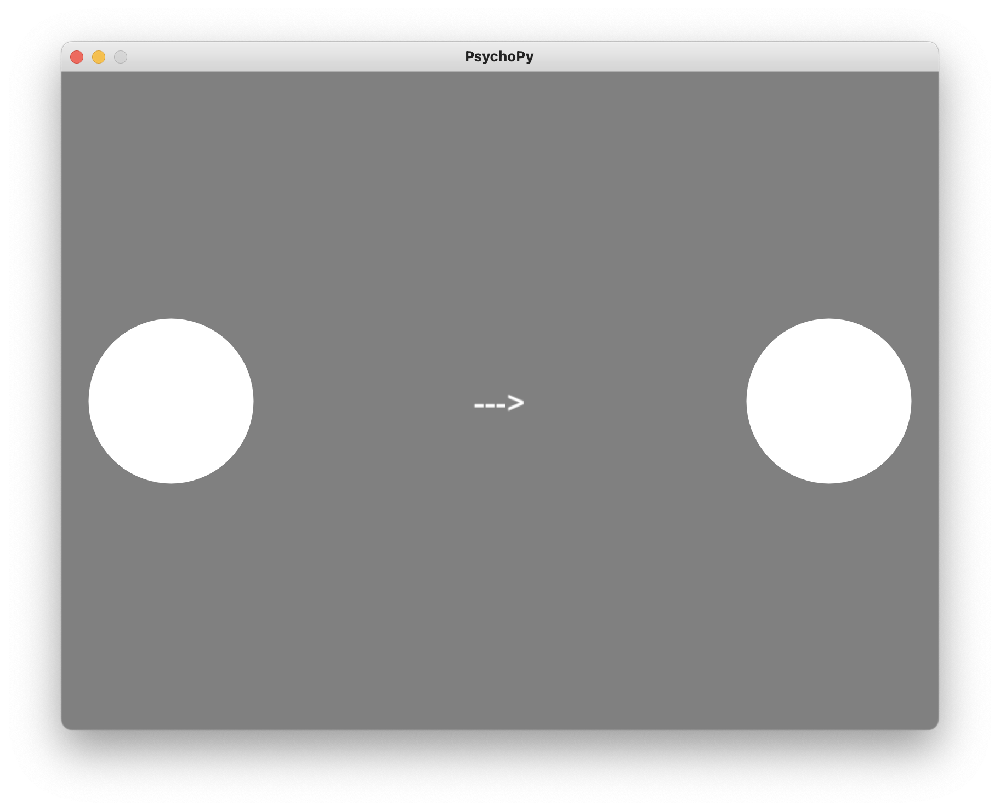
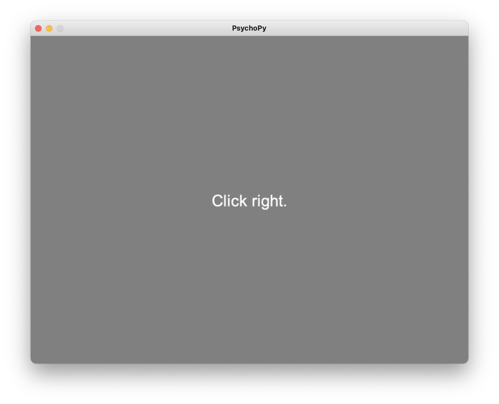

# Pyramid with PsychoPy CSV data.

Pyramid can process data from PsychoPy CSV files -- ie the [Long Wide](https://www.psychopy.org/general/dataOutputs.html#long-wide-data-file) data files that PsychoPy outputs by default.
These wide CSVs have many columns from which which Pyramid can read numeric events, text events, and/or continuous signals.

This demo is based on a PsychoPy "Hello Pyramid" task which is included here in this folder as [hello_pyramid.psyexp](./hello_pyramid.psyexp).
If you install the PsychoPy Builder ([instructions](https://www.psychopy.org/download.html)) you can play through the task yourself!

You can also find sample [data/](./data/) here in this folder.

# The Hello Pyramid Task

The Hello Pyramid task was made using the PsychoPy [Builder](https://www.psychopy.org/builder/).
It's a simple, mouse-based task aimed intended to demonstrate key aspects of working with Pyramid:
 
 - numeric events, like when trials occur
 - text events, like what the participant clicks on
 - continuous signals, like mouse trails
 - gathering data across multiple sessions
 - reusing Pyraimid config across sessions

These PsychoPy mouse tutorials were very helpful when making Hello Pyramid:

 - [Using Multiple Mouse Clicks in One Trial in PsychoPy](https://www.youtube.com/watch?v=E4LcWESNu10&ab_channel=PsychoPy)
 - [Accuracy Feedback From Key Presses & Mouse Clicks (Touchscreen Compatible)](https://www.youtube.com/watch?v=o6gG1LRngmU&ab_channel=PsychoPy)

## Playing through the task

The task asks the participant to move the mouse cursor and click on one of two targets: left or right.


Before this it gives the participant a prompt indicating the correct target to click on: **"Click left."** or **"Click right."**.

In addition it shows the participant an arrow as a cue, pointing to the left or the right: **"<---"** or **"--->"**.

On half of the trials the prompt and the cue will have the same direction -- both left or both right.
The other half of trials are miscue trials, where the prompt and cue have opposite directions.
The cue and miscue conditions are declared in the [hello_pyramid_conditions.csv](./hello_pyramid_conditions.csv).

Here's a visual summary of the conditions.
The participant is supposed to follow the prompt on each trial, and not be fooled by the cue or miscue.

| Prompt | Cue | Miscue |
| --- | --- | --- |
|  |  |  |
|  |  |  |

## Task data

PsychoPy will save timing info for each trial, including when each trial starts.
Below, we'll read these into Pyramid as trial numeric events.

It will save timing and choice info for each trial, including:
 - the text of the prompt and when it appeared
 - the text of the cue and when it appeared
 - the name of the target the participant clicked on, and when
Below, we'll read these into Pyramid as trial text events.

It will also save mouse trails for each trial as x and y position sampled once per video frame.
Below we'll read these into Pyramid as trial signals.

PsychoPy will write session data to a "long wide" CSV file.
You can generate these yourself by playing through the task.
You can also find example [data/](./data/) saved here in this repo:
 - all correct: [689056_hello_pyramid_2024-06-25_11h20.59.451.csv](./data/689056_hello_pyramid_2024-06-25_11h20.59.451.csv)
 - some errors: [350024_hello_pyramid_2024-06-25_11h22.12.994.csv](./data/350024_hello_pyramid_2024-06-25_11h22.12.994.csv)

# Processing PsychoPy Data with Pyramid

We can process data from each Hello Pyramid session using the Pyramid YAML config in [hello_pyramid.yaml](./hello_pyramid.yaml).
The YAML config tells Pyramid how understand the Hello Pyramid task and CSV data.

Here's some explanation for key parts of the YAML config.

## readers

The `readers` section tells Pyramid we're reading a "wide" CSV file and looking for events (see [WideCsvEventReader](../../src/pyramid/neutral_zone/readers/csv.py)).

```
readers:
  # Select CSV columns and how to interpret them.
  wide_reader:
    class: pyramid.neutral_zone.readers.csv.WideCsvEventReader
    args:
      csv_file: data/539585_hello_pyramid_2024-06-24_14h24.35.502.csv
      first_row_is_header: true
```

This in cludes the name of the CSV file to read, which we can also change later when we invoke Pyramid from the command line.
It tells Pyramid that the CSV starts with a header line of column names.
We'll use these column names below.

Continuing in the same `readers` section, we configure the CSV columns that Pyramid should look for and how to interpret them.

We'll select one column to interpret as numeric events:
 - column `trial.started` as a buffer of start times named `trial_started`

```
      column_config:
        trial_started:
          column_selector: [trial.started]
          numeric: true
```

We'll select four pairs of columns to interpret as text events:
 - columns `prompt.started` and `prompt_text` as a buffer of text events named `prompt`
 - columns `cue.started` and `cue_text` as a buffer of text events named `cue`
 - columns `trial.started` and `correct_target` as a buffer of text events named `correct_target`
 - columns `trial.stopped` and `mouse.clicked_name` as a buffer of text events named `clicked_name`

```
        prompt:
          column_selector: [prompt.started, prompt_text]
          numeric: false
        cue:
          column_selector: [cue.started, cue_text]
          numeric: false
        correct_target:
          column_selector: [trial.started, correct_target]
          numeric: false
        clicked_name:
          column_selector: [trial.stopped, mouse.clicked_name]
          numeric: false
          unpack_lists: true
```

We'll select three more columns to interpret as continuous signals
 - columns `mouse.time`, `mouse.x`, and `mouse.y` as buffer of signal samples named `mouse_position`

```
        mouse_position:
          column_selector: [mouse.time, mouse.x, mouse.y]
          numeric: true
          unpack_lists: true
    extra_buffers:
      mouse_position:
        reader_result_name: mouse_position
        transformers:
          - class: pyramid.neutral_zone.transformers.standard_transformers.SparseSignal
            args:
              fill_with: null
              sample_frequency: 60
              channel_ids: [x, y]
```

The `mouse_position` signal requires some extra handling and transformation from the raw CSV data.

First, each cell in these CSV columns contains a *list* of sample data, not just a scalar.
We can use the `unpack_lists` option to tell Pyramid to unpack the list elements and concatenate them with the list elements from other cells.

We also transform the data from an event list into a sampled signal.
This is because the raw data come in as explicit events of the `[time, x-position, y-position]`.
PsychoPy recordes these once per frame, but the frame timing is not guaranteed to be regular -- it's likely to have some jitter, and we may occasionally drop frames.
Moreover, the times are only recoded when PsychoPy is waiting for a response.
There are large gaps in the mouse data between trials.

Pyramid's [SparseSignal](../../src/pyramid/neutral_zone/transformers/standard_transformers.py) transformer can take events like these and interpolate them to present a continuous, regularly-sampled signal.
In this example:
 - the interpolated `sample_frequency` is `60` Hz
 - `fill_with: null` means interpolate gaps linearly rather than filling with a placeholder
 - the interpolated signal will have two channels with `channel_ids` `x` and `y`

## trials

The `trials` section tells Pyramid how to understand the trial structure of the data, and how to process data within each trial.

```
trials:
  # How to delimit and align trials in time, and process each trial.
  start_buffer: trial_started
  wrt_buffer: cue
```

We'll use `trial_started` events declared above in the `readers` section to mark the beginning and end of each trial.
We'll use `cue` events to align the data within each trial -- each trial will use the cue event time as its zero time.

Continuing in the same `trials` section, we configure a few expressions to process and annotate each trial.
See [ExpressionEnhancer](../../src/pyramid/trials/standard_enhancers.py) for more about using Python expressions to process each trial.

```
  enhancers:
    - class: pyramid.trials.standard_enhancers.ExpressionEnhancer
      args:
        expression: clicked_name.first() is not None
        value_name: complete_trial
    - class: pyramid.trials.standard_enhancers.ExpressionEnhancer
      when: complete_trial
      args:
        expression: clicked_name.first() == correct_target.first()
        value_name: correct
    - class: pyramid.trials.standard_enhancers.ExpressionEnhancer
      when: complete_trial
      args:
        expression: clicked_name.start() - cue.start()
        value_name: reaction_time
    - class: pyramid.trials.standard_enhancers.ExpressionEnhancer
      when: complete_trial
      args:
        expression: (cue.first() == '<---' and correct_target.first() == 'right') or (cue.first() == '--->' and correct_target.first() == 'left')
        value_name: miscue
```

These `enhancers` are processed in order from top to bottom.
The `expression` is a line of Python code to run for each trial.
The `value_name` is the name of the enhancement to add to each trial, with the result of the `expression`.
The `when` is another line of Python code that tells whether to bother running the `expression` that follows.

In this example:
 1. Annotated every trial as a `complete_trial` or not, based on whether the participant clicked on something.
 1. On `complete_trial`s, compare the `correct_target` name to the actual `clicked_name` and annotate whether the trial was `correct`.
 1. On `complete_trial`s, subtract the `clicked_name`'s event time to the `cue`'s start time, to compute a `reaction_time`.
 1. On `complete_trial`s, compare the promp and the cue and annotate whether the trial was a `miscue` trial.

## Running Pyramid

Here's how to run Pyramid using the YAML config above, for a particular session of data.
We'll use the `--readers` option to tell Pyramid which data file to process.

Process the "all correct" session:
```
cd pyramid/docs/psychopy-demo/
pyramid convert --trial-file all_correct.json --experiment hello_pyramid.yaml --readers wide_reader.csv_file=data/689056_hello_pyramid_2024-06-25_11h20.59.451.csv
```

Process the session with "some errors":
```
cd pyramid/docs/psychopy-demo/
pyramid convert --trial-file some_errors.json --experiment hello_pyramid.yaml --readers wide_reader.csv_file=data/350024_hello_pyramid_2024-06-25_11h22.12.994.csv
```

You can process your own session data using similar commands, substituting `--trial-file my_data.json` for the Pyramid output trial file, and `--readers wide_reader.csv_file=data/my_data.csv` for your session data CSV file.

You can also try running the Pyramid in `gui` mode to see rough plots of data from each trial.

```
cd pyramid/docs/psychopy-demo/
pyramid gui --trial-file all_correct.json --experiment hello_pyramid.yaml --readers wide_reader.csv_file=data/689056_hello_pyramid_2024-06-25_11h20.59.451.csv
pyramid gui --trial-file some_errors.json --experiment hello_pyramid.yaml --readers wide_reader.csv_file=data/350024_hello_pyramid_2024-06-25_11h22.12.994.csv
```

# Analyzing Trials File in Matlab

WIP...

load the trial file in Matlab

plot a summary of the data
   - separate miscue vs good cue
   - summarize number and percent correct
   - select mouse data between cue and selection
   - show mouse trails: green for correct, red for incorrect

screen shots