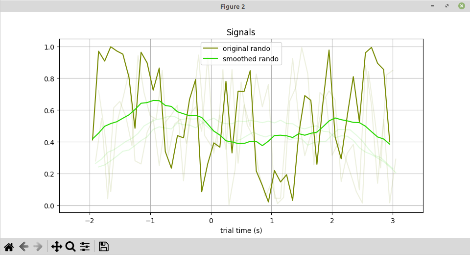

# Smooth Signals Demo

Here's a demo / example of Pyramid signal smoothign, using a per-trial "adjuster".

## overview

This example will read from two CSV files.
The first, [delimiter.csv](delimiter.csv), will partition about a minute of time into 10 trials.
The second, [demo_signal.csv](demo_signal.csv) contains a jagged signal of many random samples.

Pyramid will read in the delimiter events and signal data, partition them into trials, and plot signal chunks for each trial.
It will use a signal smoother to adjust the signal data for each trial in place, smoothing it out.
Both the original and smoothed data will be plotted for each trial.

## visualizing experiment configuration

Let's start with a graphical overview of this demo experiment.

```
cd pyramid/docs/smooth-demo

pyramid graph --graph-file demo_experiment.png --experiment demo_experiment.yaml
```

`demo_experiment.png`


This reflects much of the config set up in [demo_experiment.yaml](demo_experiment.yaml), which is the source of truth for this demo.  Pyramid will read delimiting events from one CSV file, and signal data from another CSV file.

## running with plotters

We can run this demo experiment in `gui` mode to view the signals.

```
pyramid gui --trial-file demo_trials.hdf5 --experiment demo_experiment.yaml --plot-positions plot_positions.yaml
```

This will open up two figure windows.  You might want to arrange them.
One figure will contain basic info about the experiment, demo subject, and trial extraction progress.
The other figure will show signal chunks assigned to each trial.




The trials will update every few seconds as trials occur (in `gui` mode Pyramid can simulate delay while reading from data files.)

# TODO: add a signal normalizer as a trials collecter.
# TODO: show a screen grab of the normalized signal from an HDF5 viewer.
