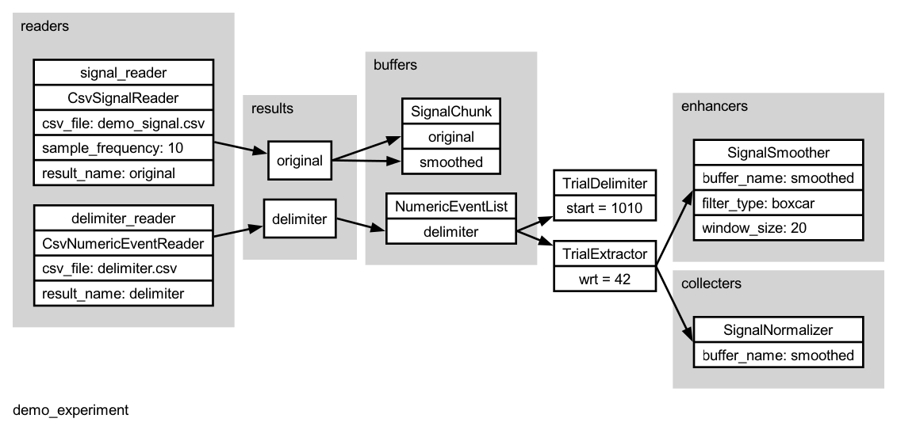

# Smooth Signals Demo

Here's a demo / example of Pyramid signal smoothign, using a per-trial "adjuster".

## overview

This example will read from two CSV files.
The first, [delimiter.csv](delimiter.csv), will partition about a minute of time into 10 trials.
The second, [demo_signal.csv](demo_signal.csv) contains a jagged signal of many random samples.

Pyramid will read in the delimiter events and signal data, partition them into trials, and plot signal chunks for each trial.
It will use a signal smoother to adjust the signal data for each trial in place, smoothing it out.
Both the original and smoothed data will be plotted for each trial.

## visualizing experiment configuration

Let's start with a graphical overview of this demo experiment.

```
cd pyramid/docs/smooth-demo

pyramid graph --graph-file demo_experiment.png --experiment demo_experiment.yaml
```

`demo_experiment.png`


This reflects much of the config set up in [demo_experiment.yaml](demo_experiment.yaml), which is the source of truth for this demo.  Pyramid will read delimiting events from one CSV file, and signal data from another CSV file.

## running with plotters

We can run this demo experiment in `gui` mode to view the signals.

```
pyramid gui --trial-file demo_trials.hdf5 --experiment demo_experiment.yaml
```

This will open up two figure windows.  You might want to arrange them.
One figure will contain basic info about the experiment, demo subject, and trial extraction progress.
The other figure will show signal chunks assigned to each trial.


The trials will update every few seconds as trials occur (in `gui` mode Pyramid can simulate delay while reading from data files.)

## Using a Pyramid collecter to normalize the signal amplitude

Someitme it may be useful to transform trial data after the fact, after seeing the whole session.  For example, we might want to normalize some signal data on each trial, based on the overall session data range.

Pyrmaid supports this kind of after-the-fact revision by way of "collecters".  These are like per-trial enhancers with an extra `collect()` method.

Collecters work like this:

 - Each configured collecter gets a chance to `collect()` each trial, as trials are coming in normally.  This is a way to gather session-wide data or statistics, for example the overall range of some signal.

 - After the last trial, before Pyramid exits, Pyramid iterates through all the trials again.  Each configured collector gets a chance to `enhance()` each trial based on the collected data or statistics, for example to rescale the data based on the overall mean.

The [SignalNormalizer](https://github.com/benjamin-heasly/pyramid/blob/main/src/pyramid/trials/standard_collecters.py#L47) is a standard Pyramid collecter that implements signal rescaling as described in the example above.

Collecters can be added to an experiment in the same way as per-trial enhancers, in the experiment YAML `trials:` section.

```
trials:
  # How to delimit Trials in time, and how to align data within each trial.
  start_buffer: delimiter
  start_value: 1010
  wrt_buffer: delimiter
  wrt_value: 42
  enhancers:
    - class: pyramid.trials.standard_adjusters.SignalSmoother
      args:
        buffer_name: smoothed
        kernel_size: 20
  collecters:
    - class: pyramid.trials.standard_collecters.SignalNormalizer
      args:
        buffer_name: smoothed
```

All of this has already happened, in fact, with the `pyramid gui ...` command above.
So, the smoothed signal data written to the trial file `demo_trials.hdf5` have been normalized for their maximum absolute value.
We don't see the normalized results plotted because the normalizing happened after-the-fact.
But we can look at the normalized data using an HDF5 viewer like the [H5Web](https://marketplace.visualstudio.com/items?itemName=h5web.vscode-h5web) extension for Visual Studio Code.


The comparison is a bit awkward, but this image shows the same signal that appears in the Pyramid plotter image above, in bright green, as "smoothed rando".
Where the original had a maximum of about 6.5, the normalized version here has a max of about 0.9.
